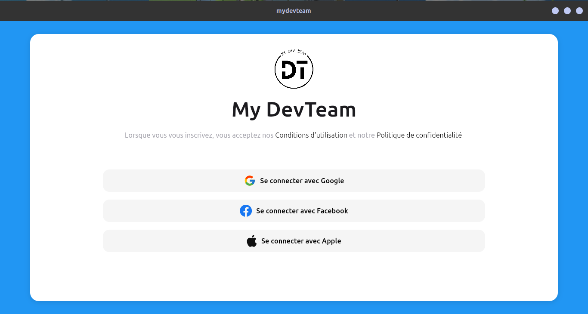
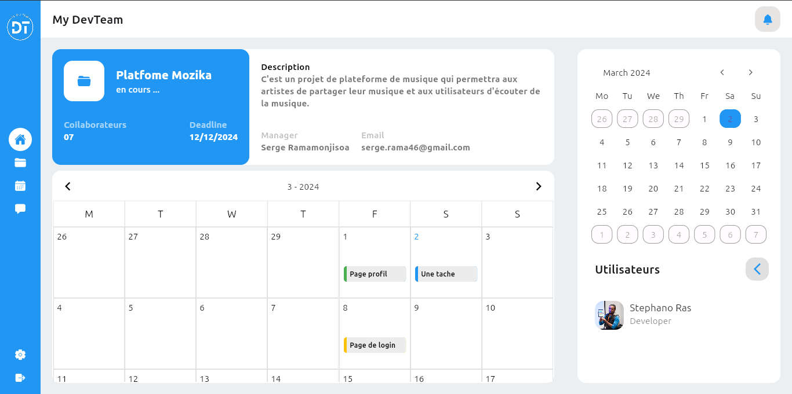
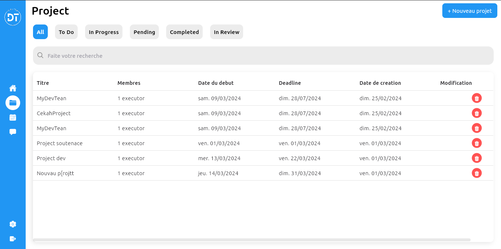
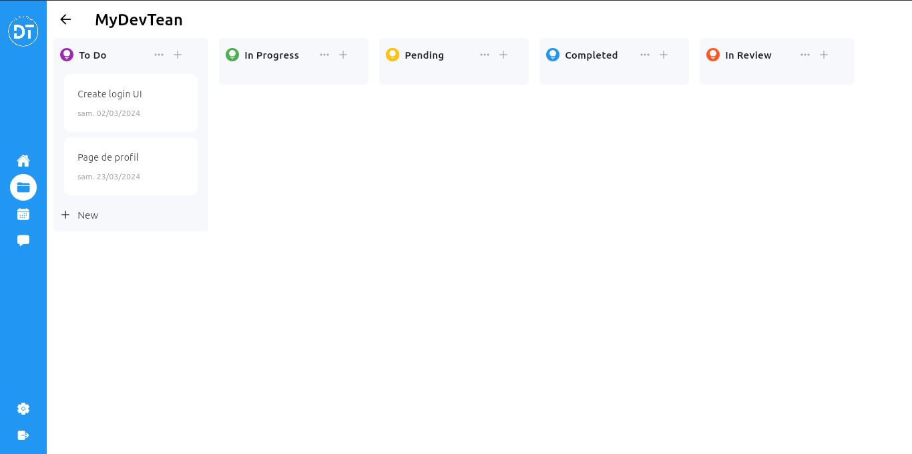
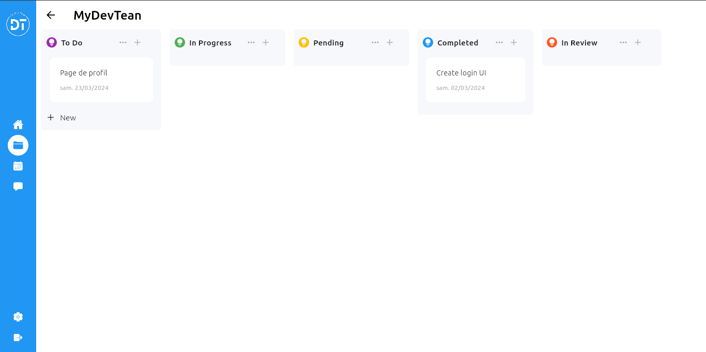
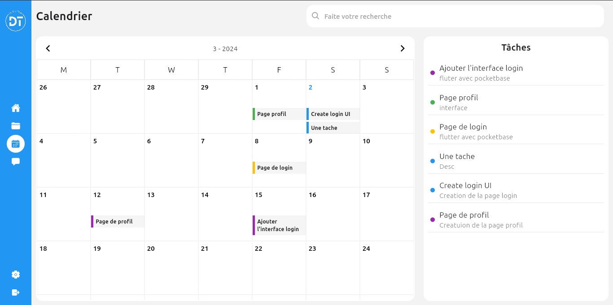
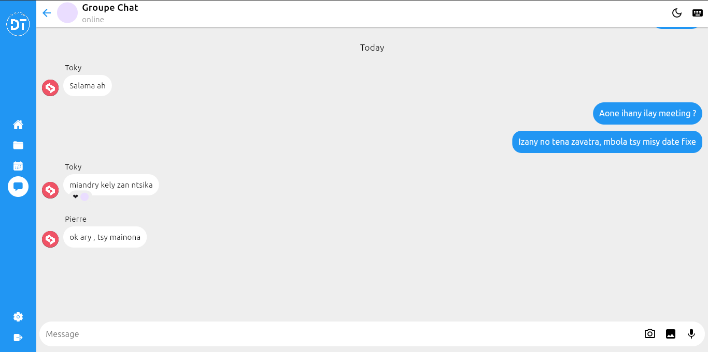

# My Devteam

PROJET DE FIN D’ETUDES POUR L’OBTENTION DU DIPLÔME DE LICENCE

Développement d'une application de gestion de projet tout-en-un.

## Objectif 

Le but du projet est de développer un logiciel qui permet de combiner gestion de projet et communication entre les personnel de l’entreprise.

## Description succincte 

Ce projet résout la dispersion des outils de gestion de projet et de  communication entre les personnel en centralisant ces fonctionnalités. L'application permettra de créer, gérer et suivre les projets et les tâches, de gérer le personnel avec leurs rôles et informations de contact, tout en fournissant des notifications, un calendrier, ainsi qu'une fonctionnalité de chat . 

## Screenshots

 

 

 
 

 

 

 

